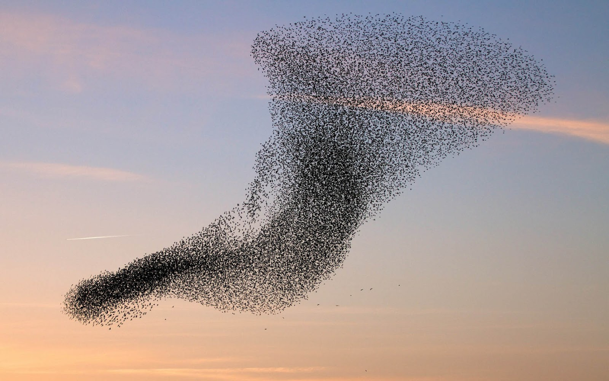

# Boids

Boids repository simulates the flocking behavior of birds using goroutines to simulate each bird as a single bird flying in the simulation.

- More about the term [boid](https://en.wikipedia.org/wiki/Boids)

### How to run?
- You must have go installed.
- Type in the same directory lvl of readme.me file  `go run .` to run de simulation.